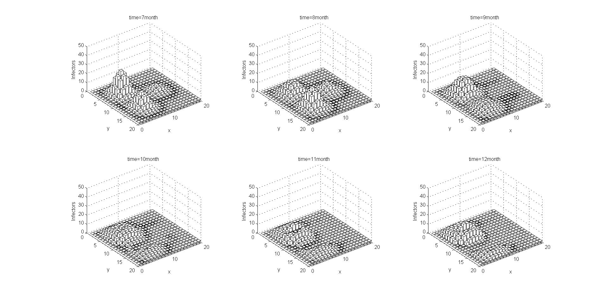
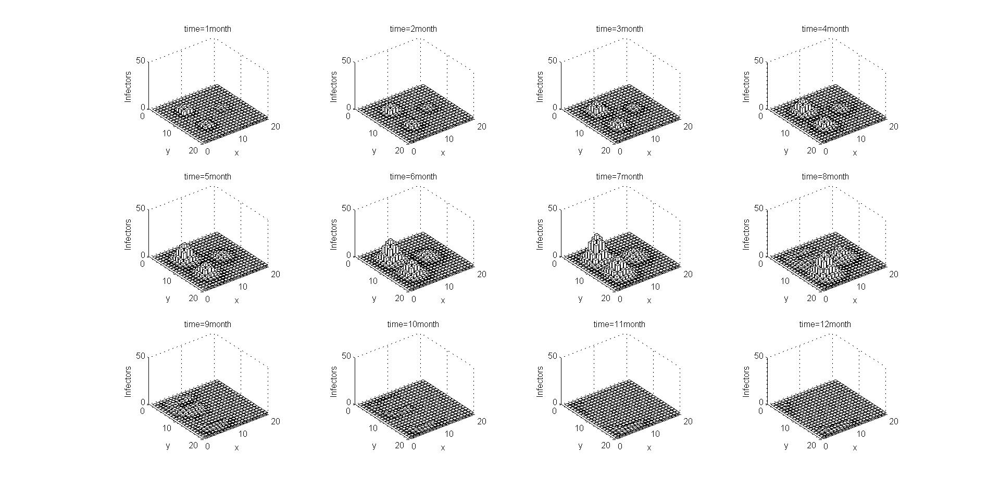
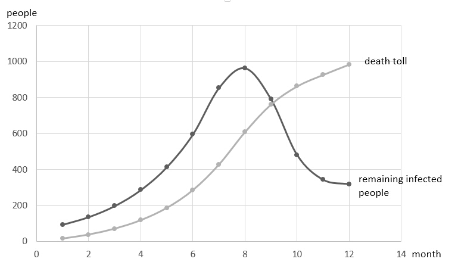

# Plague vs. Drug!

## Introduction

This is a simple toy model to demostrate and visualize the dynamic scences of the plague outbreak and the drug effect.
You can also simulate more scences and find more fun by tuning the parameters yourself!

## Install Octave

To run the program, you need MATLAB/Octave installed in your environment, and personally I'll recommend Octave since it's open-source and nearly the same as MATLAB!

It's very easy to install Octave for Mac:
```
$ brew install octave
```
... and for Linux:
```
$ sudo apt install octave
```

### bar3 problem

`bar3` is a function used in `main.m` to plot the figures.

If you use MATLAB, this error won't occur since `bar3` function is implemented in MATLAB already.

If you use Octave, `bar3` function is not a built-in function so you can use `surf` function instead.

A user named **Amro** on [Stack Overflow](http://stackoverflow.com/questions/24180890/3d-histogram-with-gnuplot-or-octave/24567637#24567637?newreg=f3e1741f209043deb5f55a793a565007) implemented a `bar3` replacement for Octave and seems to be running perfectly! I named it as `amro_bar3.m`, so you can find `amro_bar3` option in `main.m`, and use it to plot `bar3`-style figures as MATLAB do.

## Run

Once you have Octave installed in your environment, change the directory to this program with `cd`:
```
$ cd plague_model/
```
then open Octave and execute the `main.m` under its prompt:
```
$ octave
octave:1> main
```
(**Notice:** Don't run `main.m` out of Octave, like `$ octave main.m`, otherwise the figure window crashs.)

All done! You should now see the example figure with definite parameters I set in the `main.m`.

Feel free to try different parameters. Have fun~ :smile:

## Demo

To simulate the outbreak of plague:


To simulate the effect of drug:



To view the entire change process:



The trend of data:



## Other

Nearly no comments added currently. :sweat_smile:

Some English words are used uncorrectly. :sweat_smile: